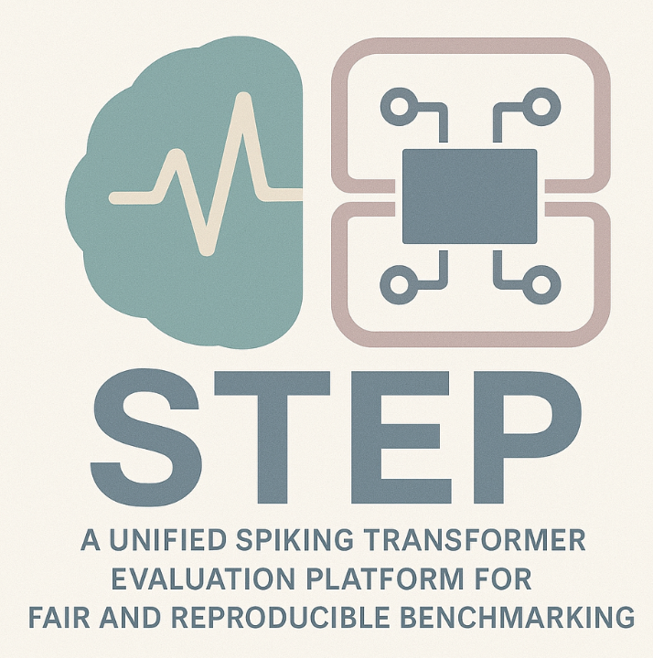

# STEP: A Unified Spiking Transformer Evaluation Platform

<p align="center">
  
</p>

<p align="center">
  
  
  
</p>

STEP is built on top of [BrainCog](https://github.com/BrainCog-X/Brain-Cog) and provides a unified pipeline for classification, segmentation, and object detection tasks using spiking transformer models. It ensures fair, reproducible benchmarking while remaining easy to extend with new models or tasks, and supports multiple backends including BrainCog, SpikingJelly, and BrainPy.

---

## 🚀 Quick Start
This is the official [STEP](https://github.com/Fancyssc/STEP) tutorial. To help you easily use and understand the content of the Benchmark framework as well as get hands-on experience with it, we will mainly provide you with tutorials on installation, model construction, and configuration.


## 📝Citation

```angular2html
@misc{shen2025stepunifiedspikingtransformer,
      title={STEP: A Unified Spiking Transformer Evaluation Platform for Fair and Reproducible Benchmarking}, 
      author={Sicheng Shen and Dongcheng Zhao and Linghao Feng and Zeyang Yue and Jindong Li and Tenglong Li and Guobin Shen and Yi Zeng},
      year={2025},
      eprint={2505.11151},
      archivePrefix={arXiv},
      primaryClass={cs.NE},
      url={https://arxiv.org/abs/2505.11151}, 
}
```